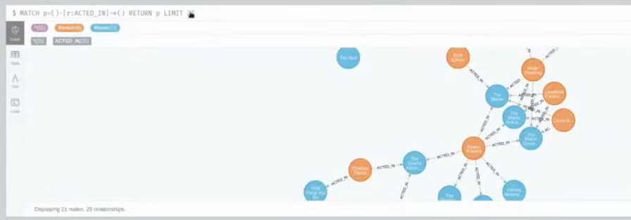
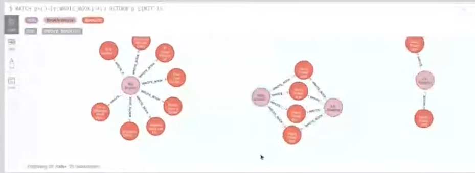

# V 6
1. postoji biblioteka sa predavanja koja je vazna za projekat
1. Cypher jezik - sintaksa
1. 
    - `p` - alias
    - `Person` - tip cvora
    - moze se izostaviti tip
    - moze se izostaviti alias, ali `:`
    - cvor moze imati vise tipova
1. 
    - u ovom slucaju je slicno, razlika je sto moze biti samo jedan tip
1. 
    - i grane i cvorovi imaju osobine
    - prvi primer ispod forme sintakse 
        - prikazuje oznacavanje osobine cvora
    - drugi primer prikazuje osobinu grane
1. 
1. Naredba Create
    - 
1. Upiti operatorom Match
    - 
        - prvo je vracanje svih naziva filmova
        - drugo je vracanje filma sa odredjenom osobinom naziv
1. notacije Grane : 
    - `--` - postoji veza, ali ne i koji tip veze
    - `<--` / `-->` - isto, samo usmereno
    - `<-` / `->` - korisceno samo kada se govori o osobini veza
    - `[r*1..4]` - postavljanje uslova kroz koliko koraka je dozvoljeno proci od jednog do drugog cvora
1. primer kreiranja grane
    - 
1. 
    - Radi update ili ubacivanje neceg novog
1. set naredba
    - 
    - ubacivanje nove osobine
1. 
    - moguce je bristi cvorove, grane, atribute
1. WHERE u kombinaciji sa MATCH
    - 
1. ORDER BY
    - 
1. VPN nakacivanje
1. 
1. 
1. cuvanje svog export-a kao backup, u slucaju da ako se desi kolaps
1. 
1. 
1. 
1. 
1. 
    - info DBa
        - nazivi cvorova DBa (u ovom slucaju su oni pobrisani, ali su ostali kao zapamceni ovde nepotrebno)
            - nemaju u sebi podatke
            - nije uradila complete reset
1. 
    - nazivi grana
        - npr. ovde nisu obrisani podaci
1. i ostalo
    - 
        - property keys
        - connection diag.
        - db diag.
1. 
    - neki pomocni skriptovi
    - bavicemo se sa `Movie Graph`
1. 
    - sekcija od dokumentacija
1. 
    - call service, settings, about
1. 
1. 
1. 
    - klikom na izvrsen upit kopira se na traku za unos
        - isto tu je collapse card, close card opcija
    - moguce je izmeniti sastav te naredbe
    - klik na play
1. 
    - 
    - atributi cvora
1. 
    - prikaz veza
    - 
1.  
    - takodje za neki vezani cvor je moguce sagledati osobine
    - 
1. 
    - lock / unlock
    - ovo i ne igra neku bitnu ulogu
    - 
1. 
    - Dismiss - isto ne igra neku ulogu
1. 
    - tabelarni prikaz
    - 
    - dosta je neprirodno posmatrati podatke tabelarno
        - jedino ima smisla ako za npr. izlistavanje naziva nekog filma
        - uglavnom koristimo grafovski prikaz
1. 
    - tekstualni prikaz
1. 
    - deo sa code-om je servisna info.
1. 
    - export
1. 
1. za grane
    - 
1. 
1. 
1. 
    - movie : 38, ali nas to nije zanimalo, ni 140 cvorova, vec 170 veza
1. 
    - `create (m:Movie{title:"Zona Zamfirova", released:2002, tagline:"Ene ga kuce u caksire"})`
    - `Match (n:Movie) return n`
    - `Match (n:Movie{title:"Zona Zamfirova"}) return n`
1. 
    - `create(p:Person {name:"Vojin Cetkovic", born:1971})`
    - `Match (p:Person{name:"Vojin Cetkovic"}) return p`
1. 
    - 2 nacina:
        - `MATCH (p:Person{name:"Vojin Cetkovic"}),(m:Movie{title:"Zona Zamfirova"}) CREATE (p)-[r:ACTED_IN{roles:"Mane Kujundzija"}]->(m)] return r`
        - `MATCH (p:Person),(m:Movie) WHERE p.name:"Vojin Cetkovic" and m.title:"Zona Zamfirova" CREATE (p)-[r:ACTED_IN{roles:"Mane Kujundzija"}]->(m)] return r`
        - POGRESNO je NAPISANO na prvu loptu `role` umesto `roles` *i ono je to prihvatilo*
            - stoga, nije kao u RBP da ce da pazi na uniformnost, vec moramo sami
1. 
    - `MATCH (m:Movie {title:"The godfather"}) return m`
1. 
    - `match (p)-[r:ACTED_IN]->(m:Movie{title:"The godfather"}) RETURN p`
    > ili ( OVO JE NESTO SPOREDNO, kao zackoljica )
    - `match p=()-[r:ACTED_IN]->(m:Movie{title:"The godfather"}) RETURN p`
    - 
    > Moj ubog pokusaj
    > `MATCH (p:Person) WHERE (p)-[:ACTED_IN]->(m:Movie{title:"The godfather"}) RETURN p`
1. 
    - sada ne zelimo ceo cvor
        - vec naslov i godinu filma
    - `match (m:Movie)<-[:ACTED_IN]-(:Person{title:"Marlon Brando"}) return m.title, m.released`
1. 
    - `match (:Person{name:"Al Pacino"})-[:ACTED_IN]->(m)<-[:ACTED_IN]-(p) return p`
    > ili
    - `match (p)-[:ACTED_IN]->(m)<-[:ACTED_IN]-(p1:Person{name:"Al Pacino"}) return p`
    > moj neki rad \
    > `match (p:Person), (ap:Person{name:"Al Pacino"}) WHERE (ap)-[:ACTED_IN]->()) return p`
1. 
    - `match (p{name: "Marlon Brando"}) set p.nickname = "Bud" return p`
1. 
    - `match (p:Person) return `**`p.name`**` ORDER BY p.name ASC`
    > pogresan pristup
    - `match (p:Person) return p ORDER BY p.name ASC`
1. 
    - `match (p:Person) where p.born < 1970 return p`
    > greska: moze da postoji jos neki tip sa born
    - `match (p) where p.born < 1970 return p`
    > bez where ne moze
1. 
    - `match (p{name: "Marlon Brando"}) remove p.nickname return p`
1. 
    - `merge (p:Person{born: 1930}) on match set p.isOld = TRUE return p`
    > moglo je i ovako
    - `match (p:Person{born: 1930}) set p.isOld = TRUE return p`
1. 
    - `match (p{name: "Marlon Brando"}) delete p`, ALI DESI SE crash,
        - 
    - pa sada je potrebno delovati tako da moramo brisati veze sa ovim cvorom, ALI POSTOJI JEDNOSTAVNIJI NACIN:
    - `match (p{name: "Marlon Brando"})  `**`detach`**` delete p`
    - "razvezao"
1. 
    - producent je **osoba** vezan vezom `[:PRODUCED]`
    - `match (p:Person)-[:PRODUCED]->(m) return p`
1. 
    - `match (d:Person)-[:DIRECTED]->(m)<-[:PRODUCED]-(:Person{name:"Joel Silver"}) return d`
1. 
    - `match (m)<-[:REVIEWED{rating: 100}]-(p) return m`
1. odluka je dizajna da nema director, producent, actor,...; nego vec po glagolu u vezi da se vrsi struktuiranje
1. 
    - `match (p:Person)-[:PRODUCED]->()<-[:DIRECTED]-(p) return p, m`

    # 7 vezba
1. Ucitavanje csv fajla u bazu, npr. `book1.csv`
1. Direktno iz Cypher
1. nista obimno u ovom slucaju
1. mongoDB fazon dataset nije dobar, jer ima puno ugnjezdavanja
1. odsekla je i uzela 2000 linija
1. za kolonu gde se podaci ponavljaju generise se cvor
    - prica o vezivanju cvorova
        - npr. `publisher_date` je property veze izmedju cvora `book` i `publisher`
1. radi ilustracije pravimo poseban cvor, npr. `review`
1. Zadatak da se otklone greske/nepotrebnosti iz fajla: prosireni razmaci, predugacak naziv lepo prikazati
1. 
1. postoji i prezentacija
    - 
        - `load csv` je koristan za manjeg obima importe
        - `bulk import` iz cli-a
        - kettle import tool
1. 
1. 
    - potreba za posedovanjem lokalnog neo4j
1.  😁
1. 
1. 
1. 
1. 
1. kopiranje csv-ova na namestenu putanju
    - 
1. 
    ```Cypher
    CREATE CONSTRAINT ON (b:Book) ASSERT b.bookID IS UNIQUE;
    CREATE CONSTRAINT ON (a:BookAuthor) ASSERT a.name IS UNIQUE;
    CREATE CONSTRAINT ON (p:Publisher) ASSERT p.name IS UNIQUE;
    LOAD CSV WITH HEADERS FROM "file:///books1.csv" AS line
    WITH line, SPLIT(line.authors, '/') AS authors, SPLIT(line.publication_date,"/") as
    dateComponents
    MERGE (book: Book {bookID:line.bookID, title:line.title, isbn:line.isbn, isbn13:line.isbn13,
    language: line.language_code, num_pages:line.num_pages})
    MERGE (publisher:Publisher {name:line.publisher})
    MERGE (reviewInfo:ReviewInfo {avg_rating:line.average_rating, ratings_count:line.ratings_count,
    text_reviews_count:line.text_reviews_count})
    FOREACH (author IN authors| MERGE (auth:BookAuthor {name: author}) MERGE (auth)-
    [:WROTE_BOOK]->(book))
    MERGE (book)-[:IS_RATED_BOOK]->(reviewInfo)
    MERGE (publisher)-[:PUBLISHED_BOOK {date:date({day: toInteger(dateComponents[1]),
    month: toInteger(dateComponents[0]), year: toInteger(dateComponents[2])})}]->(book)
    ```
1. 
1. 
1. 
1. NIJE OVO HTELA DA PRIKAZE 
1. 
1. 
    - pretprocesiranje je pomenuto gore
1. 
1. pregled gornjeg koda:
    - 
    - splitovanje
        - 
    - lepse merge od insert. jer radi update
        - 
    - lep primerak kako se radi
        - 
    - interesantno zbog datuma
        - 
    ---
1. 
    - iz jave
    - 
    - tj.
    ```java
    driver = GraphDatabase.driver("bolt://hostAddress:7687", AuthTokens.basic( "admin", "admin"));
    Session session = driver.session();
    session.writeTransaction(new TransactionWork<Integer>() {
        @Override
        public Integer execute(Transaction tx) {
            Map<String, Object> parameters = new HashMap<String, Object>();
            parameters.put("title", title); parameters.put("released", released);
            tx.run("CREATE (m:Movie {title:$title, released:$released})",parameters);
            for(int i=0;i<actors.length;i++){
                tx.run("MATCH (a:Movie{title:$title}),(b:Person{name:'"+actors[i]+"'})
                CREATE (b)-[r:ACTED_IN]->(a)",parameters);
            }
        return 1;
        }
    ```
1. ZA PROJEKAT MOZE NA OBA NACINA, Najlakse cypher
1. mora se iskoristiti graphDataScience biblioteka